# device_systems

## Descripción

`device_systems` es una API REST desarrollada con FastAPI para administrar usuarios. El proyecto mantiene el recurso `/users` y su CRUD completo: consultar, crear, actualizar y eliminar usuarios.

En esta versión, la lista temporal en memoria fue reemplazada por persistencia real. Los usuarios se guardan en una base de datos SQLite mediante SQLAlchemy, por lo que los datos permanecen disponibles después de reiniciar el servidor.

## Tecnologías

- Python
- FastAPI
- Uvicorn
- SQLAlchemy
- SQLite
- Pydantic v2
- Email-validator

## Estructura del proyecto

```text
device_systems/
├── app/
│   ├── main.py
│   ├── database/
│   │   └── connection.py
│   ├── models/
│   │   └── user_model.py
│   ├── schemas/
│   │   └── user_schema.py
│   ├── routes/
│   │   └── user_routes.py
│   ├── services/
│   │   └── user_service.py
│   └── dependencies/
│       ├── database_dependency.py
│       └── user_dependencies.py
├── requirements.txt
└── README.md
```

- `app/main.py`: crea la aplicación, registra el router y crea las tablas al iniciar.
- `app/database/connection.py`: configura SQLite, el motor, las sesiones y `Base`.
- `app/models/user_model.py`: define la tabla `users` con SQLAlchemy.
- `app/schemas/user_schema.py`: valida los datos de entrada y define la respuesta JSON con Pydantic.
- `app/routes/user_routes.py`: expone los endpoints HTTP bajo `/users`.
- `app/services/user_service.py`: contiene la lógica de acceso y operación sobre la base de datos.
- `app/dependencies/database_dependency.py`: entrega y cierra correctamente una sesión SQLAlchemy.
- `app/dependencies/user_dependencies.py`: centraliza la búsqueda de un usuario o el error 404.
- `requirements.txt`: dependencias necesarias del proyecto.

El archivo `device_systems.db` se genera automáticamente en la raíz del proyecto cuando la aplicación inicia. Está ignorado por Git para no incluir datos locales o de prueba.

## Instalación

Desde la carpeta `device_systems/`:

```powershell
python -m venv venv
venv\Scripts\activate
pip install -r requirements.txt
```

También se puede utilizar el entorno local existente:

```powershell
.\sistema\Scripts\python.exe -m pip install -r requirements.txt
```

## Ejecución

```powershell
uvicorn app.main:app --reload
```

La API queda disponible en:

```text
http://127.0.0.1:8000
```

Al iniciar, FastAPI importa el modelo `User` y ejecuta:

```python
Base.metadata.create_all(bind=engine)
```

Esto crea la tabla `users` si aún no existe, sin borrar los registros guardados.

## Endpoints

| Método | Endpoint | Descripción | Respuesta exitosa |
|---|---|---|---|
| `GET` | `/users` | Lista usuarios, con filtros y ordenamiento opcionales | `200 OK` |
| `GET` | `/users/{user_id}` | Consulta un usuario por ID | `200 OK` |
| `POST` | `/users` | Crea un usuario | `201 Created` |
| `PUT` | `/users/{user_id}` | Actualiza los campos enviados de un usuario | `200 OK` |
| `PATCH` | `/users/{user_id}` | Actualiza parcialmente un usuario | `200 OK` |
| `DELETE` | `/users/{user_id}` | Elimina un usuario | `204 No Content` |

## Modelo SQLAlchemy y schema Pydantic

El modelo SQLAlchemy representa la estructura real de la tabla:

- `id`: entero, llave primaria e índice.
- `name`: texto obligatorio.
- `email`: texto obligatorio y único, con índice.
- `role`: texto obligatorio, con índice.
- `is_active`: booleano obligatorio, con valor predeterminado `True` e índice.
- `created_at`: fecha y hora de creación, con valor predeterminado e índice.

El schema Pydantic representa los datos que entran y salen por HTTP:

- `UserCreate`: datos requeridos para crear.
- `UserUpdate`: campos opcionales enviados en PUT.
- `UserPatch`: campos opcionales enviados en PATCH.
- `UserResponse`: estructura de la respuesta, incluye `id` y `created_at`.

`UserResponse` utiliza `from_attributes=True`, lo que permite convertir directamente una instancia SQLAlchemy en la respuesta Pydantic.

## Validaciones y constraints

Las validaciones de Pydantic son:

- `name` obligatorio y con mínimo 3 caracteres.
- `email` obligatorio y con formato válido.
- `role` limitado a `admin`, `support` o `user`.
- `is_active` obligatorio para actualizaciones explícitas y booleano.
- En PUT y PATCH se rechaza un cuerpo sin campos útiles.

La base de datos protege adicionalmente los datos con:

- `nullable=False` en los campos obligatorios.
- `unique=True` en `email`.
- Índices en los campos de consulta y ordenamiento.
- `is_active` con valor predeterminado `True`.
- `created_at` con valor predeterminado de fecha y hora.

La revisión previa del correo evita respuestas duplicadas y el servicio también captura `IntegrityError`, hace `rollback()` y devuelve un error controlado si otra petición registra el mismo correo simultáneamente.

## Manejo de errores

| Situación | Código HTTP | Respuesta |
|---|---:|---|
| Datos inválidos, email incorrecto o rol no permitido | `422` | Detalle de validación de Pydantic |
| Email duplicado | `400` | `{"detail": "El correo ya está registrado"}` |
| Usuario no encontrado en GET, PUT, PATCH o DELETE | `404` | `{"detail": "Usuario no encontrado"}` |
| PUT o PATCH sin campos para actualizar | `400` | Mensaje indicativo |
| Operación correcta de lectura o actualización | `200` | Usuario o lista de usuarios |
| Creación correcta | `201` | Usuario creado |
| Eliminación correcta | `204` | Sin contenido |

## Swagger y ReDoc

Con el servidor ejecutándose, abre:

```text
http://127.0.0.1:8000/docs
http://127.0.0.1:8000/redoc
```

Swagger muestra el esquema de cada endpoint, los modelos solicitados, los parámetros de consulta y los códigos de respuesta. Cada operación puede probarse con **Try it out** y **Execute**.

## Prueba rápida de los endpoints

Puedes usar Swagger o herramientas como PowerShell, Postman o Thunder Client. Una secuencia mínima es:

1. `POST /users` con datos válidos y verificar `201`.
2. Repetir el `POST` con el mismo email y verificar `400`.
3. `GET /users` y verificar `200` con el usuario persistido.
4. `GET /users/{id}` usando el `id` devuelto y verificar `200`.
5. `GET /users/999999` y verificar `404`.
6. `GET /users?role=user` y verificar el filtro.
7. `GET /users?is_active=true` y verificar el filtro.
8. `PUT /users/{id}` con datos actualizados y verificar `200`.
9. `PATCH /users/{id}` con un solo campo y verificar `200`.
10. `DELETE /users/{id}` y verificar `204`.
11. `GET /users/{id}` nuevamente y verificar `404`.

También conviene probar un email con formato inválido, un nombre de menos de 3 caracteres y un rol diferente de los permitidos; todos deben producir `422`.

## Evidencia de la ejecución

No se generaron capturas nuevas en esta implementación. Para la entrega, toma manualmente evidencias actuales de:

1. La estructura del proyecto en VS Code.

2. La terminal con `uvicorn app.main:app --reload` iniciado.

3. Swagger en `/docs` y ReDoc en `/redoc`.
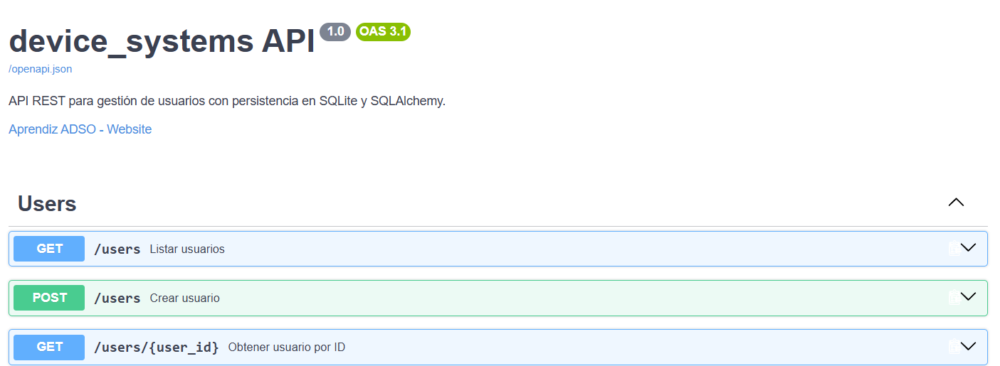
redocs
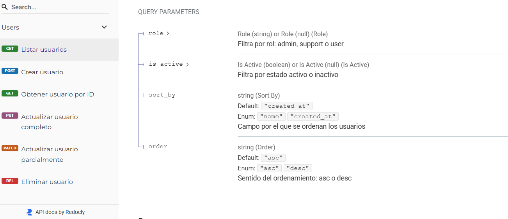
4. Cada uno de los pasos de la prueba rápida, incluyendo los códigos `201`, `400`, `200`, `204` y `404`.
#post
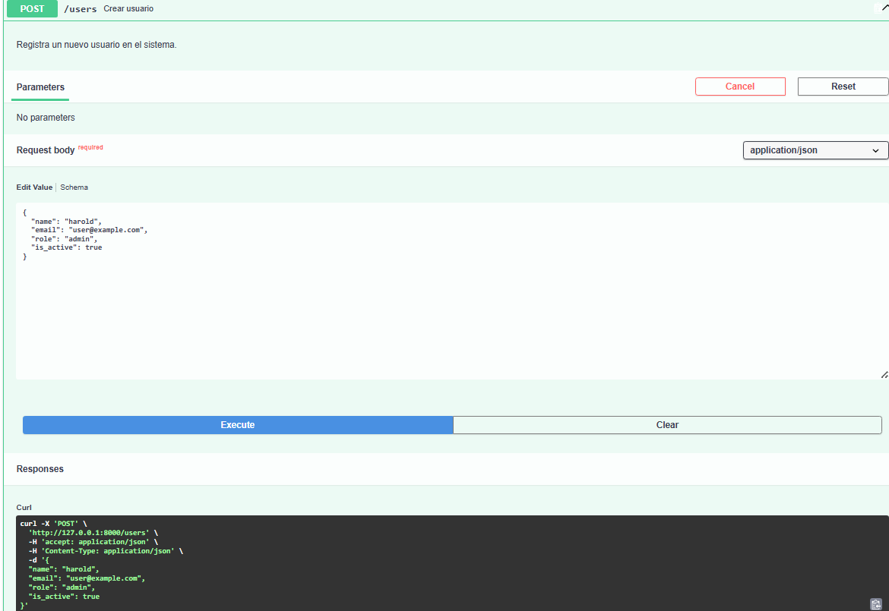
#get 
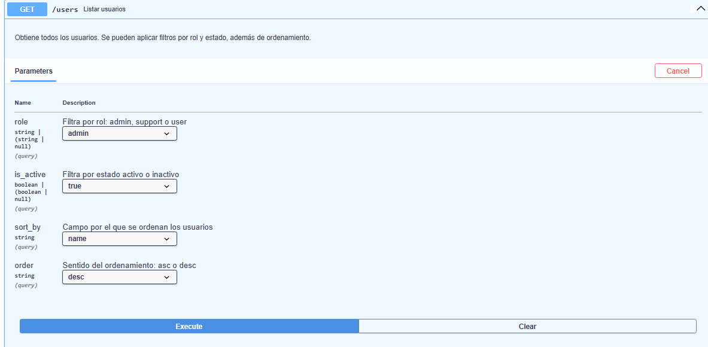
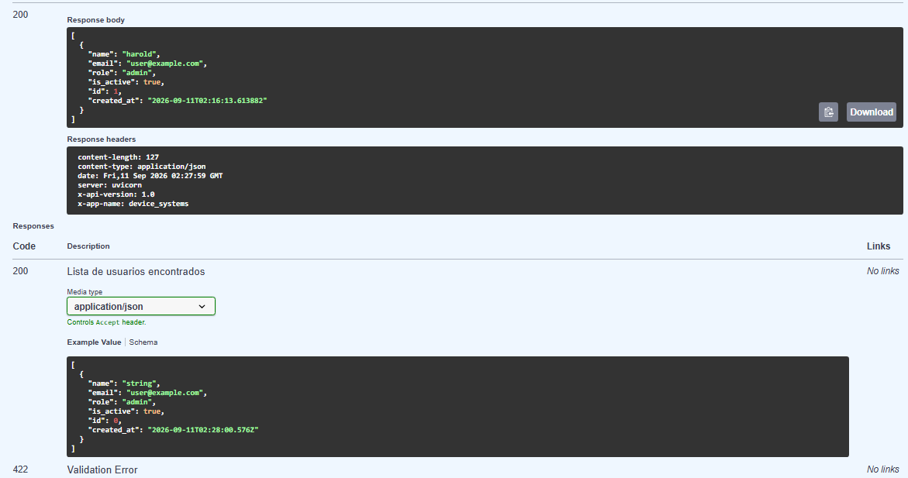
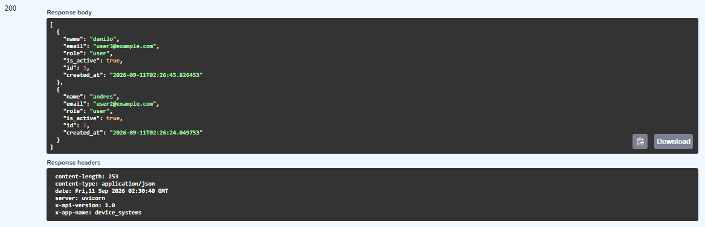
#get por id
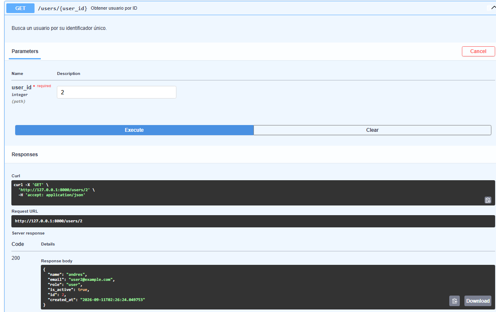
#put 
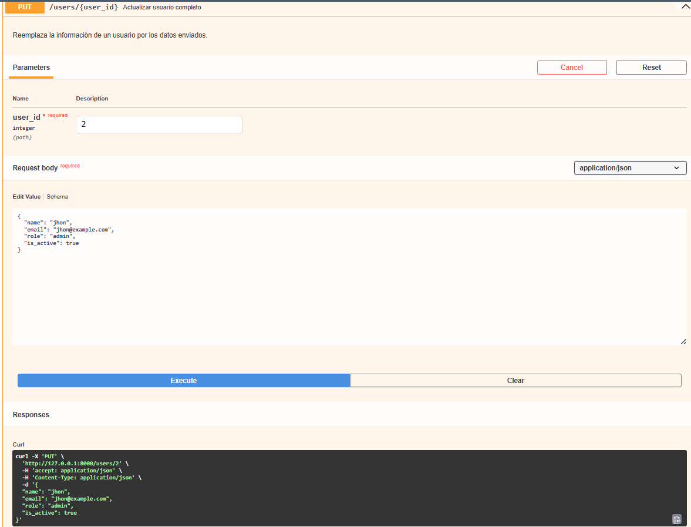
base de datos
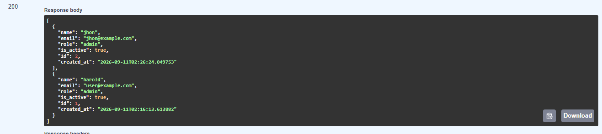
#patch
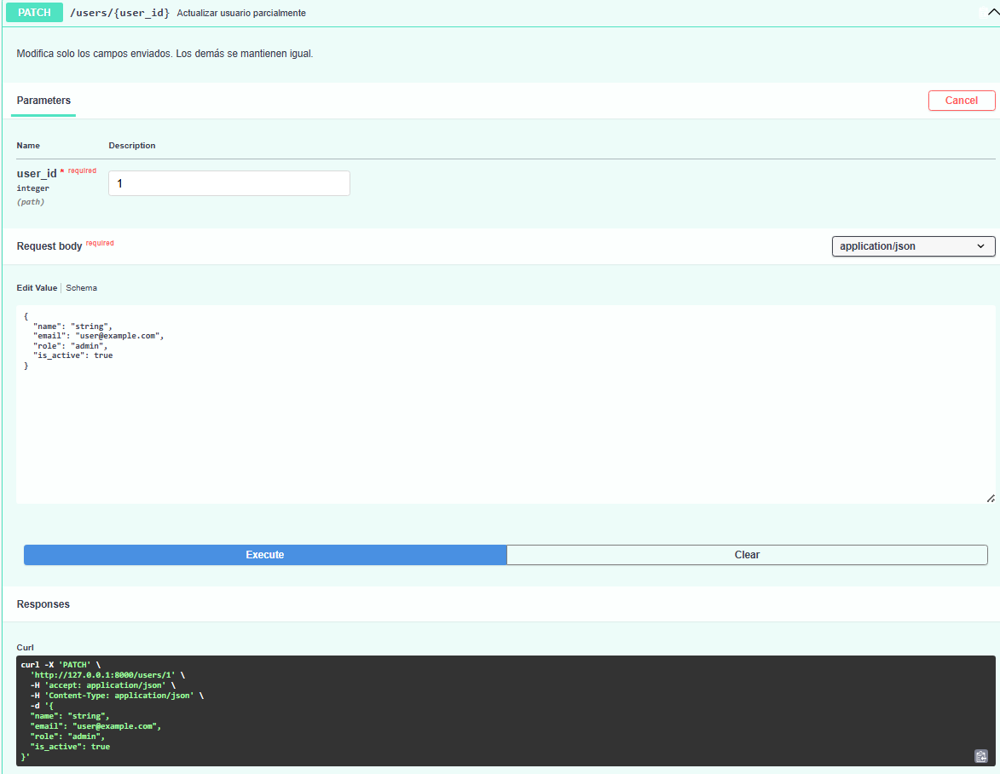
base de datos
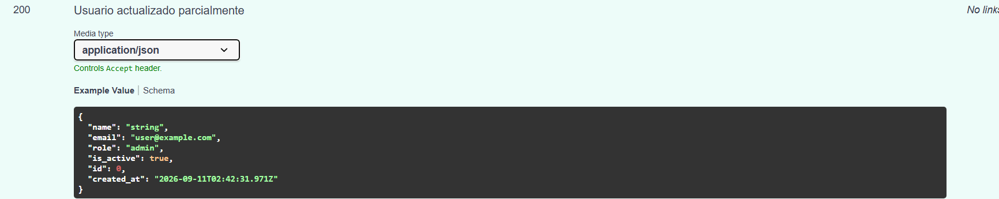
#delete
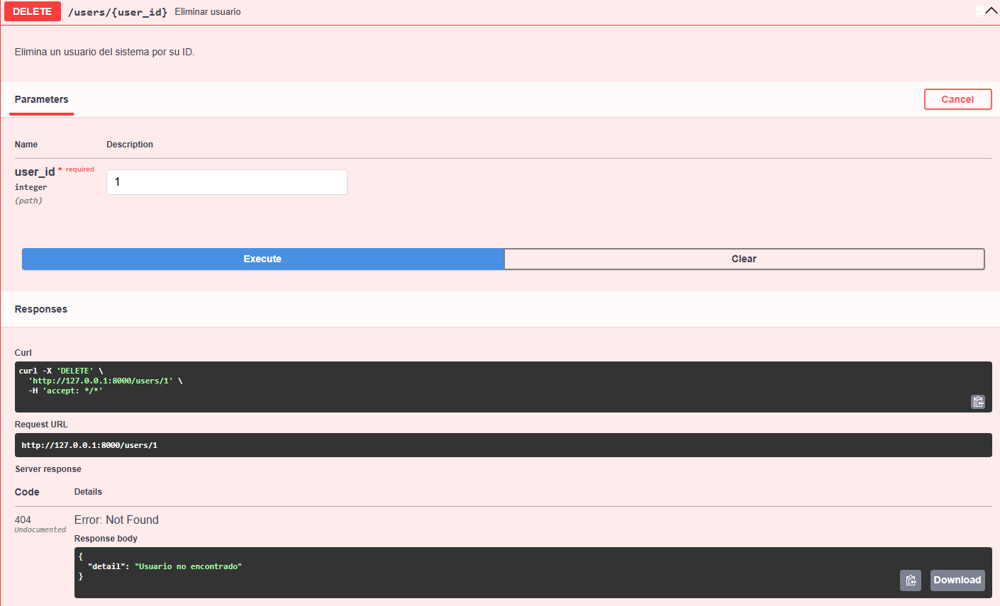
5. La persistencia después de reiniciar el servidor y volver a consultar un usuario creado.

datos guardados
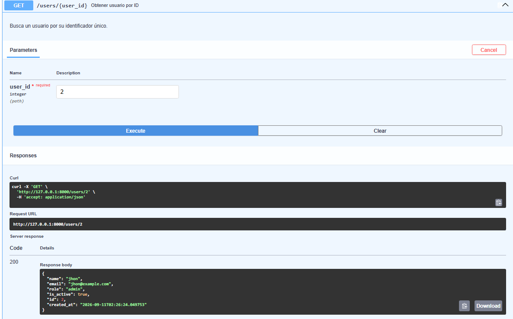


## Reflexión

La lista en memoria fue útil para comprender las rutas, las validaciones de Pydantic, los códigos HTTP y la separación entre rutas, servicios y dependencias. Sin embargo, también mostró una limitación importante: los datos desaparecían cada vez que se reiniciaba la aplicación.

También reforcé el valor de organizar el proyecto en capas. Las rutas se encargan de recibir las peticiones y devolver respuestas HTTP, los servicios contienen la lógica de acceso a los datos, los modelos describen la tabla y los schemas validan la información que entra y sale. Esta separación hace que el código sea más claro, reutilizable y fácil de mantener.

La implementación de `Depends()` para obtener la sesión de base de datos y buscar un usuario existente permitió centralizar responsabilidades que antes estaban repetidas en varias rutas. Además, las pruebas de los endpoints y la comprobación de los datos después de reiniciar el servidor confirmaron que la persistencia funciona correctamente.