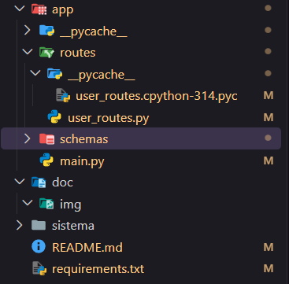
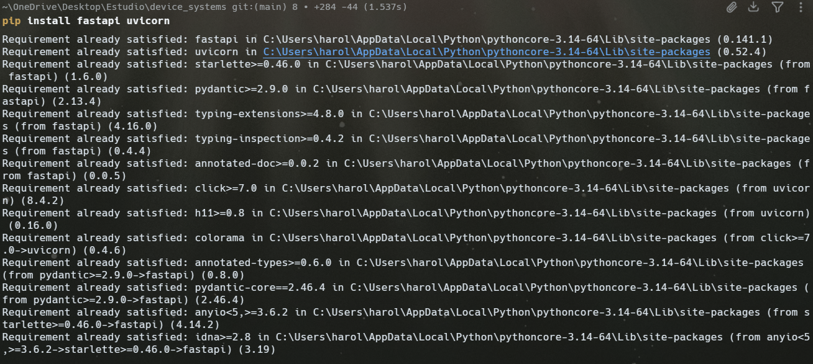
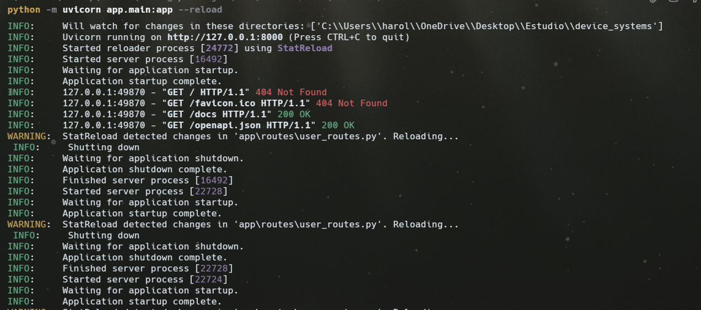
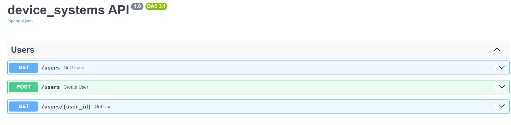
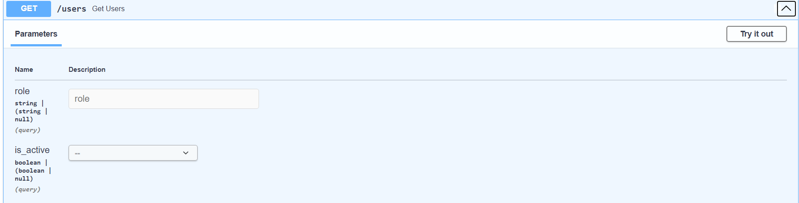
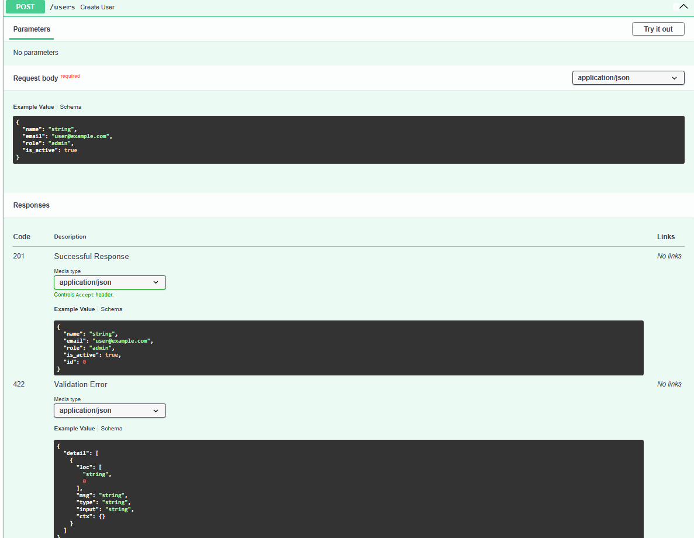

# device_systems

## Descripción

`device_systems` es una API REST sencilla para gestionar usuarios. Fue realizada como una actividad introductoria de FastAPI, por eso los datos se guardan en una lista en memoria y no en una base de datos.

## Objetivo

Practicar endpoints `GET` y `POST`, parámetros de ruta y consulta, validaciones con Pydantic, modelos de respuesta, cabeceras HTTP y documentación automática con Swagger UI.

## Tecnologías utilizadas

- Python
- FastAPI
- Uvicorn
- Pydantic v2
- Email-validator

## Estructura del proyecto

```text
device_systems/
├── app/
│   ├── main.py
│   ├── schemas/
│   │   └── user_schema.py
│   └── routes/
│       └── user_routes.py
├── requirements.txt
└── README.md
```

- `app/main.py`: crea FastAPI, configura nombre y versión, agrega middleware y conecta las rutas.
- `app/schemas/user_schema.py`: contiene los modelos Pydantic que validan los datos recibidos y enviados.
- `app/routes/user_routes.py`: contiene la lista de usuarios y los endpoints de la API.
- `requirements.txt`: lista las dependencias necesarias.
- `README.md`: explica cómo instalar, ejecutar y probar la actividad.

## Instalación

Desde una terminal de VS Code, ubicada en la carpeta del proyecto, ejecuté estos pasos en Windows:

```powershell
python -m venv venv
venv\Scripts\activate
pip install -r requirements.txt
```

También se pueden instalar directamente las dependencias con `pip install fastapi uvicorn email-validator`. El entorno virtual mantiene las librerías del proyecto separadas de otras instalaciones de Python.

## Modelo de usuario

`UserCreate` representa los datos que el cliente envía al crear un usuario. No tiene `id` porque ese dato lo genera la API. `UserResponse` hereda esos datos y agrega `id`, por lo que se usa para devolver el usuario completo.

Las validaciones son: `name` obligatorio con mínimo 3 caracteres, `email` con formato válido, `role` únicamente `admin`, `support` o `user`, e `is_active` de tipo booleano.

## Datos de prueba

La variable `users` es una lista en memoria con un admin, un support y un user. Hay usuarios activos e inactivos. Se usa una lista porque esta es una actividad introductoria; al reiniciar el servidor, los usuarios creados con `POST` desaparecen.

## Ejecución

Desde la carpeta `device_systems/` ejecuté:

```powershell
uvicorn app.main:app --reload
```

`app.main:app` significa buscar `main.py` dentro de `app` y usar la variable llamada `app`. No se utiliza `main:app` porque `main.py` no está en la raíz. El servidor queda en `http://127.0.0.1:8000`.

## Swagger

Abrí `http://127.0.0.1:8000/docs`. Swagger UI muestra los endpoints agrupados con la etiqueta `Users`.

Para probar uno, se abre, se pulsa `Try it out`, se escriben los parámetros o el JSON, se pulsa `Execute` y se revisan el código HTTP y la respuesta.

## Endpoints

| Método | Endpoint | Descripción |
|--------|----------|-------------|
| GET | `/users` | Muestra todos los usuarios |
| GET | `/users/{user_id}` | Busca por ID (Path Parameter) |
| GET | `/users?role=admin` | Filtra por rol |
| GET | `/users?is_active=true` | Filtra por estado |
| POST | `/users` | Crea un usuario nuevo |

`GET` consulta información. Un Path Parameter va dentro de la ruta, como el `1` en `/users/1`. Un Query Parameter va después de `?`, como `role=admin`; se combinan con `&`, por ejemplo `/users?role=admin&is_active=true`.

El endpoint `GET /users` acepta opcionalmente `role` e `is_active`, así que una sola ruta sirve para todos los filtros. Si el ID no existe, responde `404` con `Usuario no encontrado`.

Para `POST /users` se envía:

```json
{
  "name": "Pedro",
  "email": "pedro@gmail.com",
  "role": "user",
  "is_active": true
}
```

La API valida con Pydantic, revisa el correo, genera el ID, guarda el usuario y responde `201 Created`. Si el correo ya existe, responde `400` con `El correo ya está registrado`.

## Validaciones

FastAPI devuelve `422 Unprocessable Entity` cuando Pydantic encuentra datos inválidos. Un nombre como `"A"` falla por longitud, `"correo-malo"` falla por formato de correo, `"administrador"` falla porque no es un rol permitido y `"hola"` falla porque no es un booleano válido para `is_active`.

## Response Models

Un Response Model indica la forma de los datos que la API devuelve. Las listas usan `list[UserResponse]` y los usuarios individuales usan `UserResponse`. Esto mantiene respuestas claras, las documenta en Swagger y evita campos no definidos.

## Cabeceras HTTP

El middleware agrega a todas las respuestas:

```text
X-App-Name: device_systems
X-API-Version: 1.0
```

Una cabecera HTTP es información adicional que viaja con la petición o respuesta. La primera identifica la aplicación y la segunda indica la versión de la API.

## Pruebas realizadas

En Swagger UI realicé estas pruebas:

| Prueba | Datos o acción | Resultado esperado |
|--------|----------------|--------------------|
| GET /users | Ejecutar sin filtros | Lista y `200` |
| GET por ID | `user_id=1` | Harold y `200` |
| Filtro por rol | `role=admin` | Solo admin y `200` |
| Filtro por estado | `is_active=true` y `false` | Resultado filtrado y `200` |
| Filtros combinados | `role=admin`, `is_active=true` | Resultado filtrado y `200` |
| ID inexistente | `user_id=999` | `404` |
| POST correcto | JSON de Pedro | Usuario creado y `201` |
| Correo duplicado | Repetir correo de Pedro | `400` |
| Nombre incorrecto | `name: "A"` | `422` |
| Correo incorrecto | `email: "correo-malo"` | `422` |
| Rol incorrecto | `role: "administrador"` | `422` |
| Estado incorrecto | `is_active: "hola"` | `422` |

## Evidencias

Tomé estas capturas para entregar la actividad:

1. **Estructura:** explorador de VS Code con las carpetas y archivos del proyecto.
 
2. **Instalación:** terminal con el entorno activado y las dependencias instaladas.
  
3. **Servidor:** terminal con `uvicorn app.main:app --reload` y el servidor iniciado.
  
4. **documentacion:** `/docs` mostrando la API y la sección `Users`.
  
5. **GET /users:** usuarios de prueba y código `200`.
 
6. **GET /users/{user_id}:** usuario con ID `1` y código `200`.
 
7. **POST /users/{user_id}:** usuario con ID `999` y código `404`.
  


## Reflexión

En esta actividad aprendí que FastAPI permite crear endpoints de forma organizada y que Swagger facilita las pruebas. También entendí que Pydantic valida los datos antes de que lleguen a la función. Al principio confundía los parámetros de ruta con los de consulta, pero ejemplos como `/users/1` y `/users?role=admin` me ayudaron a diferenciarlos. La lista en memoria me permitió concentrarme en FastAPI, aunque entendí que un proyecto real necesitaría una base de datos.


