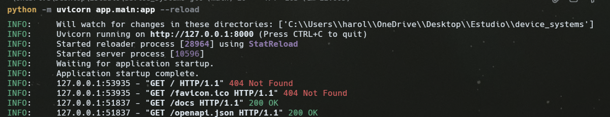
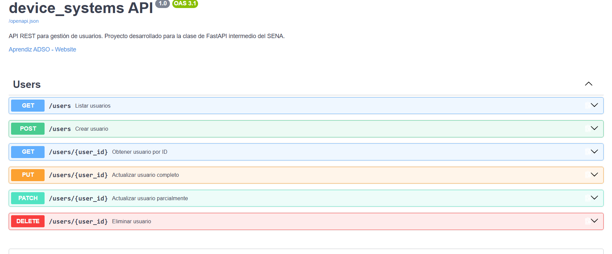
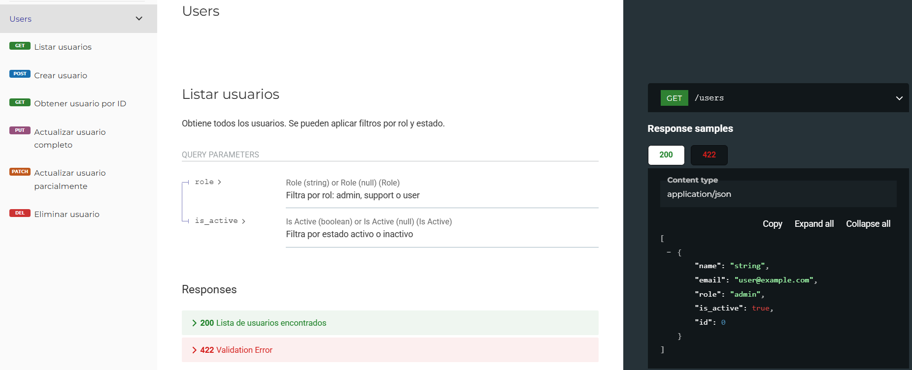
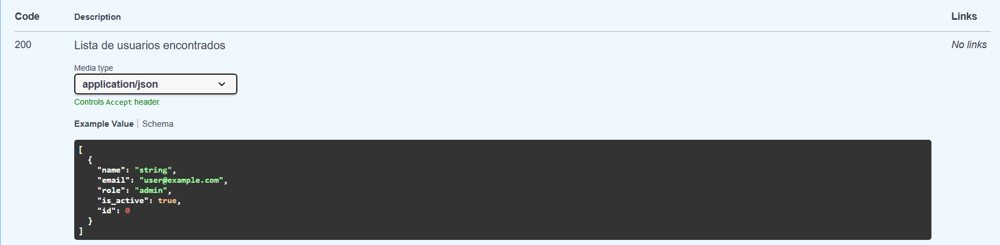
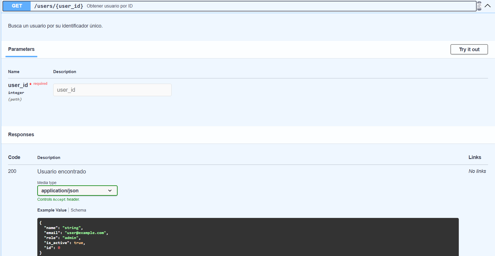
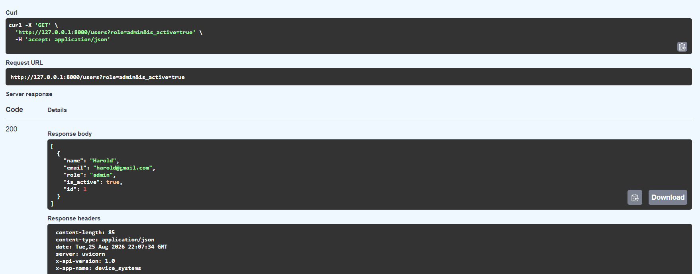
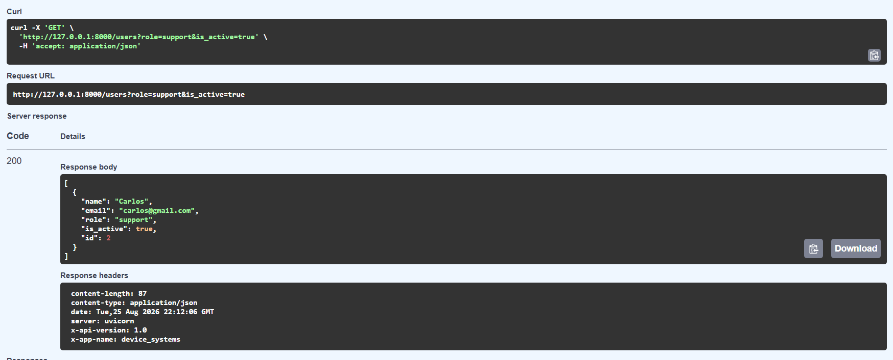
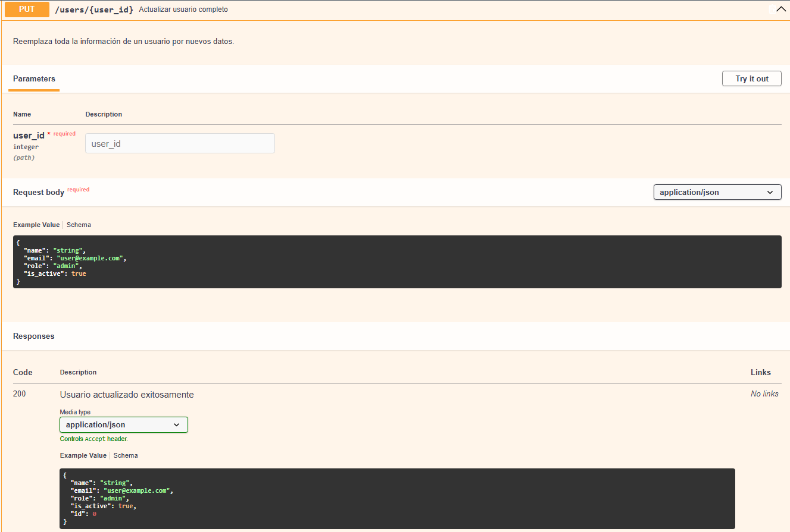
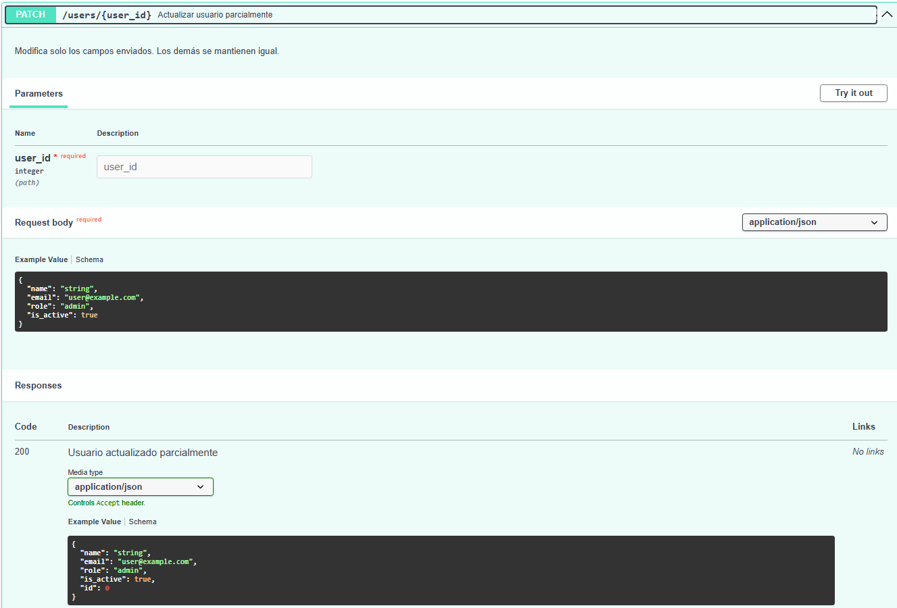
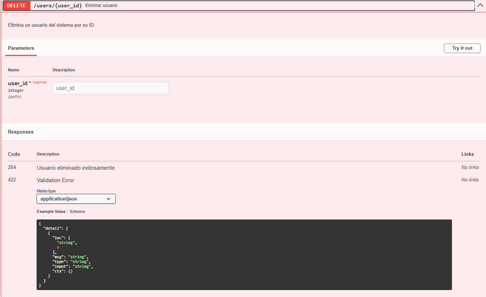

# device_systems

## Descripción

`device_systems` es una API REST sencilla para gestionar usuarios. Empezó como una actividad introductoria de FastAPI y ahora evolucionó para incluir el CRUD completo, manejo de errores, documentación Swagger/OpenAPI y Dependency Injection. Los datos se guardan en una lista en memoria porque el enfoque es aprender FastAPI sin complicaciones de base de datos.

## Objetivo

Practicar FastAPI intermedio: CRUD completo con PUT, PATCH y DELETE, manejo de errores con `HTTPException`, códigos de estado HTTP correctos, Dependency Injection con `Depends()`, documentación Swagger/OpenAPI y pruebas funcionales.

## Tecnologías utilizadas

- Python
- FastAPI
- Uvicorn
- Pydantic v2
- Email-validator

## Estructura del proyecto

```text
device_systems/
├── app/
│   ├── main.py
│   ├── routes/
│   │   └── user_routes.py
│   ├── schemas/
│   │   └── user_schema.py
│   ├── services/
│   │   └── user_service.py
│   ├── dependencies/
│   │   └── user_dependencies.py
│   └── data/
│       └── users_db.py
├── requirements.txt
└── README.md
```

- `app/main.py`: crea la app FastAPI, configura Swagger, middleware y rutas.
- `app/routes/user_routes.py`: define los endpoints CRUD de usuarios.
- `app/schemas/user_schema.py`: modelos Pydantic para validar datos de entrada y salida.
- `app/services/user_service.py`: lógica de negocio separada de las rutas.
- `app/dependencies/user_dependencies.py`: funciones reutilizables con `Depends()`.
- `app/data/users_db.py`: lista en memoria que simula la base de datos.
- `requirements.txt`: dependencias del proyecto.
- `README.md`: documentación de la API.

## Instalación

Desde una terminal ubicada en la carpeta `device_systems/`:

```powershell
python -m venv venv
venv\Scripts\activate
pip install -r requirements.txt
```

## Ejecución

```powershell
uvicorn app.main:app --reload
```

El servidor queda disponible en `http://127.0.0.1:8000`.

## Swagger / OpenAPI

- Swagger UI: `http://127.0.0.1:8000/docs`
- ReDoc: `http://127.0.0.1:8000/redoc`

En Swagger se pueden probar todos los endpoints pulsando **Try it out** y luego **Execute**.

## CRUD y endpoints

| Método | Endpoint | Descripción | Código éxito |
|--------|----------|-------------|--------------|
| GET | `/users` | Listar todos los usuarios | 200 |
| GET | `/users/{user_id}` | Obtener un usuario por ID | 200 |
| POST | `/users` | Crear un usuario nuevo | 201 |
| PUT | `/users/{user_id}` | Reemplazar completamente un usuario | 200 |
| PATCH | `/users/{user_id}` | Actualizar parcialmente un usuario | 200 |
| DELETE | `/users/{user_id}` | Eliminar un usuario | 204 |

### Parámetros

- **Path Parameter:** va dentro de la ruta. Ejemplo: `GET /users/1`
- **Query Parameter:** va después de `?`. Ejemplo: `GET /users?role=admin&is_active=true`

## Ejemplos de peticiones

### GET /users

Devuelve todos los usuarios.

```json
[
  {
    "id": 1,
    "name": "Harold",
    "email": "harold@gmail.com",
    "role": "admin",
    "is_active": true
  }
]
```

### GET /users?role=admin

Filtra usuarios por rol.

### GET /users?is_active=true

Filtra usuarios activos. Usar `false` para inactivos.

### GET /users?role=admin&is_active=true

Filtro combinado.

### POST /users

Crea un usuario nuevo.

```json
{
  "name": "Pedro",
  "email": "pedro@gmail.com",
  "role": "user",
  "is_active": true
}
```

Respuesta: `201 Created` con el usuario creado incluyendo el `id`.

### PUT /users/1

Reemplaza completamente el usuario con ID 1.

```json
{
  "name": "Harold Actualizado",
  "email": "harold.new@gmail.com",
  "role": "admin",
  "is_active": false
}
```

Respuesta: `200 OK` con el usuario actualizado.

### PATCH /users/1

Actualiza solo el rol del usuario con ID 1.

```json
{
  "role": "support"
}
```

Respuesta: `200 OK` con el usuario modificado.

### DELETE /users/1

Elimina el usuario con ID 1.

Respuesta: `204 No Content` (sin cuerpo).

## Manejo de errores

| Situación | Código | Respuesta |
|-----------|--------|-----------|
| Usuario no encontrado | 404 | `{"detail": "Usuario no encontrado"}` |
| Correo duplicado | 400 | `{"detail": "El correo ya está registrado"}` |
| PATCH sin datos | 400 | `{"detail": "No se enviaron datos para actualizar"}` |
| Datos inválidos | 422 | Detalle de validación de Pydantic |

## Modelos Pydantic

- `UserCreate`: datos para crear un usuario.
- `UserUpdate`: datos para actualizar completamente (PUT).
- `UserPatch`: datos para actualizar parcialmente (PATCH).
- `UserResponse`: datos que devuelve la API al cliente.

Validaciones:
- `name` obligatorio, mínimo 3 caracteres.
- `email` con formato válido.
- `role` solo `admin`, `support` o `user`.
- `is_active` booleano.

## Response Models

Cada endpoint usa `response_model` para definir la estructura de la respuesta:
- `GET /users` → `list[UserResponse]`
- `GET /users/{user_id}` → `UserResponse`
- `POST /users` → `UserResponse`
- `PUT /users/{user_id}` → `UserResponse`
- `PATCH /users/{user_id}` → `UserResponse`

Esto mantiene las respuestas estandarizadas y evita enviar datos innecesarios.

## Cabeceras HTTP

Todas las respuestas incluyen:

```text
X-App-Name: device_systems
X-API-Version: 1.0
```

## Dependency Injection

En `app/dependencies/user_dependencies.py` creé la función `get_user_or_404(user_id)` usando `Depends()`.

Esta dependencia:
1. Recibe un `user_id`.
2. Busca el usuario en la "base de datos".
3. Si existe, lo devuelve.
4. Si no existe, lanza un `HTTPException` con código 404.

En las rutas se usa así:

```python
def get_user(user_id: int):
    return get_user_or_404(user_id)
```

Ventaja: no repetimos la misma lógica de búsqueda y manejo de 404 en cada endpoint.

## Códigos HTTP utilizados

- `200 OK`: respuestas exitosas de lectura y actualización.
- `201 Created`: usuario creado exitosamente.
- `204 No Content`: eliminación exitosa sin cuerpo de respuesta.
- `400 Bad Request`: correo duplicado, PATCH sin datos, etc.
- `404 Not Found`: usuario inexistente.
- `422 Unprocessable Entity`: datos inválidos enviados por el cliente.

## Pruebas

Probar desde Swagger UI (`/docs`) o ReDoc (`/redoc`):

1. `GET /users` → debe listar los usuarios de prueba.
2. `GET /users/1` → debe devolver a Harold.
3. `GET /users/999` → debe devolver 404.
4. `GET /users?role=admin` → debe filtrar solo admin.
5. `GET /users?is_active=true` → debe filtrar activos.
6. `GET /users?role=admin&is_active=true` → filtro combinado.
7. `POST /users` con datos válidos → debe crear y devolver 201.
8. `POST /users` con correo duplicado → debe devolver 400.
9. `POST /users` con nombre corto → debe devolver 422.
10. `PUT /users/1` con datos completos → debe actualizar y devolver 200.
11. `PUT /users/999` → debe devolver 404.
12. `PATCH /users/1` con `{"role": "support"}` → debe actualizar y devolver 200.
13. `PATCH /users/1` sin datos → debe devolver 400.
14. `PATCH /users/999` → debe devolver 404.
15. `DELETE /users/1` → debe devolver 204.
16. `DELETE /users/999` → debe devolver 404.

También se pueden probar desde Postman o Thunder Client enviando las mismas peticiones.

## Evidencias

Para la entrega tomar estas capturas:

1. Estructura del proyecto en VS Code.

2. Terminal con el servidor funcionando (`uvicorn app.main:app --reload`).

3. Swagger UI (`/docs`) mostrando los endpoints agrupados en `Users`.

4. ReDoc (`/redoc`) mostrando la documentación.

5. `GET /users` con respuesta 200.

6. `GET /users/1` con respuesta 200.

7. `GET /users?role=admin` con respuesta 200.

8. `GET /users?is_active=true` con respuesta 200.

9. `GET /users?role=admin&is_active=true` con respuesta 200.

10. `POST /users` con respuesta 201.

11. `PUT /users/1` con respuesta 200.

12. `PATCH /users/1` con respuesta 200.

13. `DELETE /users/1` con respuesta 204.



## Reflexión
 los fundamentos: rutas GET y POST, parámetros de ruta y consulta, validaciones con Pydantic y Response Models. En esta Clase 8 entendí cómo evolucionar ese proyecto hacia un CRUD completo.

Lo que más me costó fue separar la lógica en servicios y dependencias. Al principio todo estaba en las rutas y funcionaba, pero cuando agregué PUT, PATCH y DELETE me di cuenta de que estaba repitiendo mucho código. Crear `user_service.py` me ayudó a centralizar la lógica y las rutas quedaron más limpias.

Dependency Injection con `Depends()` al principio me pareció innecesaria, pero después de usarla en `get_user_or_404` entendí su valor: evito repetir la búsqueda de usuario y el manejo de 404 en cada endpoint. Si en el futuro necesito agregar permisos o autenticación, ya tengo el patrón listo.

También entendí mejor los códigos HTTP. Antes usaba 200 para todo, pero ahora sé que 201 es para creación, 204 para eliminación sin contenido y 400 para errores del cliente. Swagger y ReDoc son mucho más útiles cuando los endpoints tienen buena documentación con `summary` y `description`.

La lista en memoria sigue siendo una limitación, pero me permitió concentrarme en FastAPI sin distraerme con bases de datos. Ahora entiendo por qué en un proyecto real se separan las capas: rutas, servicios, datos y dependencias. No es sobreingeniería, es organización.
